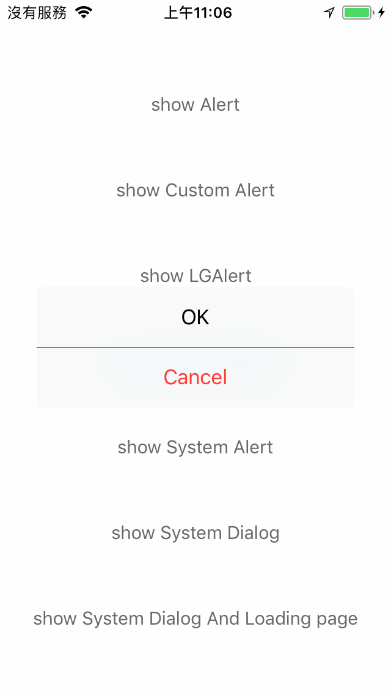
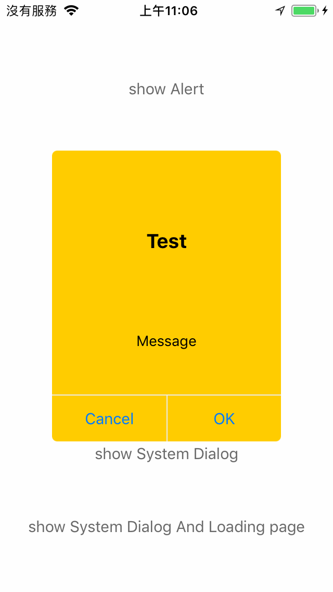
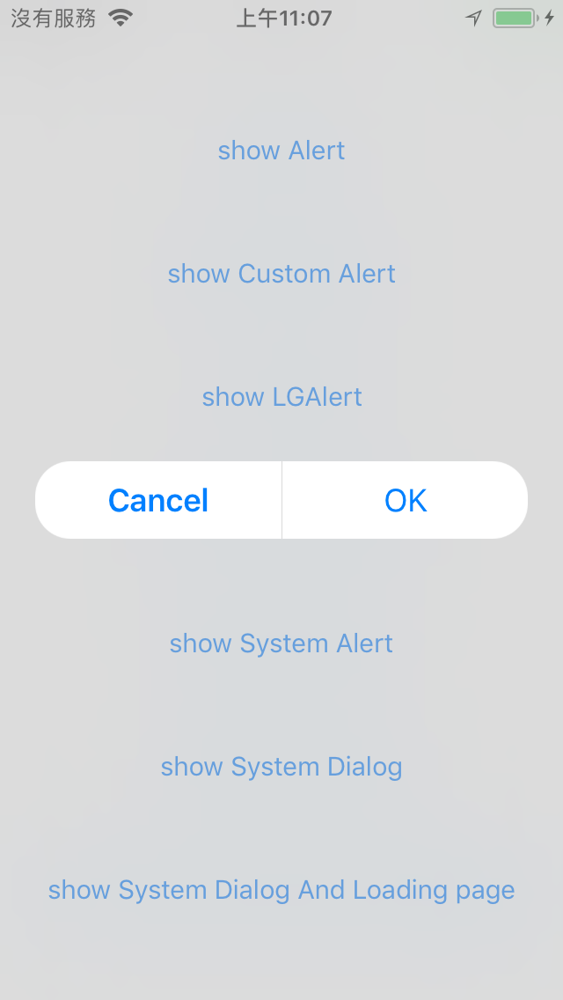
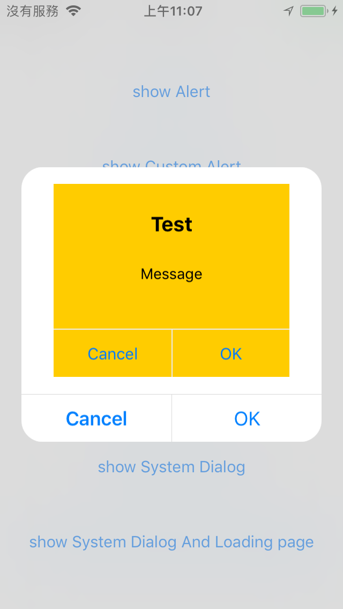
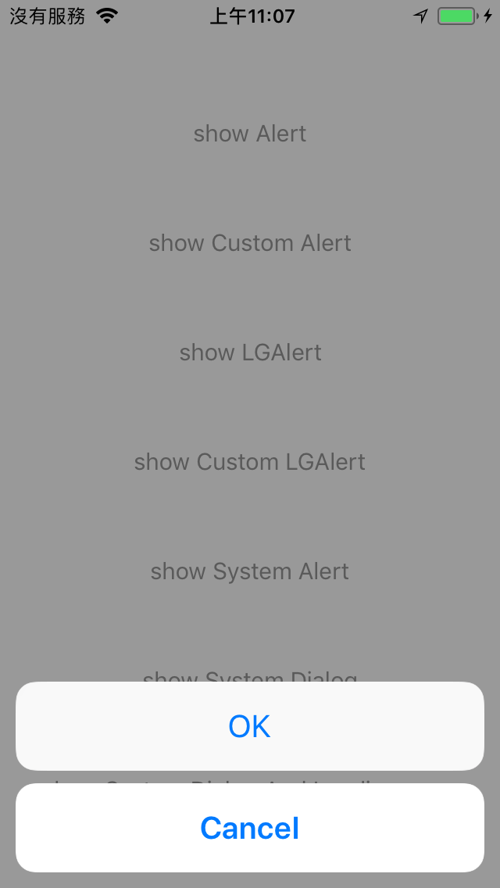
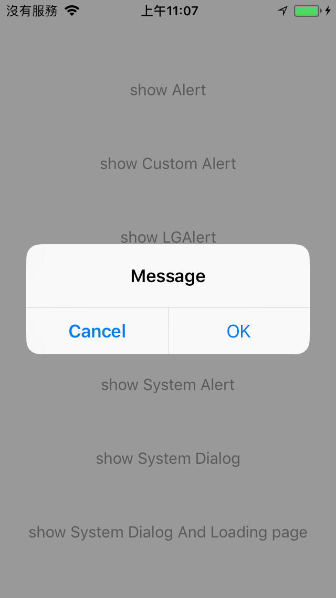
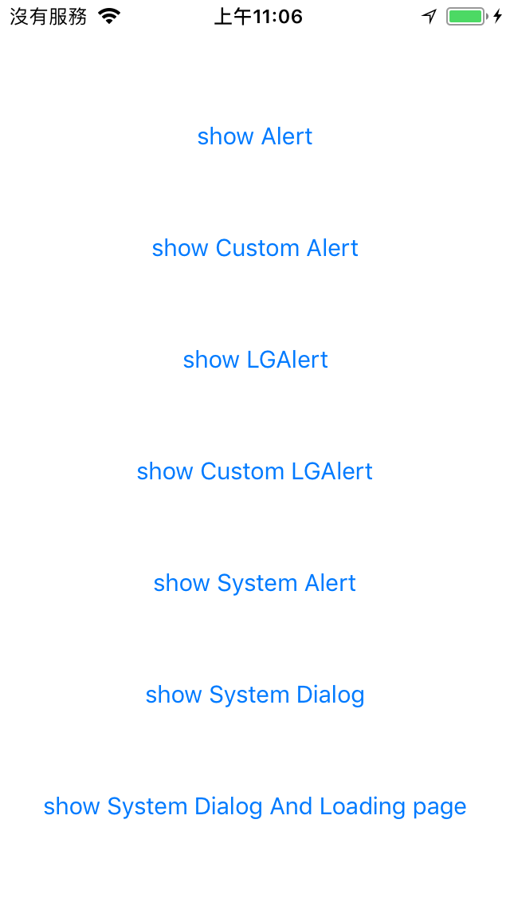
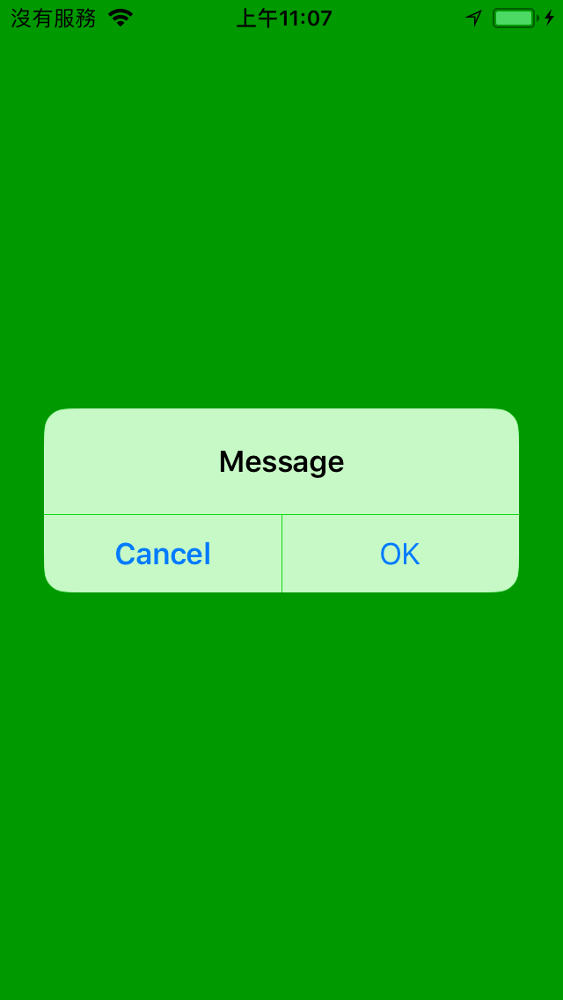

# IRAlertManager 

- IRAlertManager is a powerful alert manager for iOS, which can handle different alert frameworks.

## Features
- Handle different alert frameworks.
- Support a global loading view.

## Install
### Git
- Git clone this project.
- Copy this project into your own project.
- Add the .xcodeproj into you  project and link it as embed framework.
#### Options
- You can remove the `demo` and `ScreenShots` folder.

### Cocoapods
- Add `pod 'IRAlertManager'`  in the `Podfile`
- `pod install`

## Usage

### Basic

- The `demo` show three diffrent alert systems, include `Apple system alert`,  `XFDialogBuilder`, and `LGAlertView`.

- Assum you want to handle with a alert system named `DEMOAlert`, you can follow as below:

- Create a new class `IRDEMOAlert` extends `IRAlert`, and Import `IRAlertManager`
```obj-c
#import <IRAlertManager/IRAlertManager.h>

typedef NS_ENUM(NSUInteger, IRDEMOAlertStyle) {
    IRDEMOAlertStyleAlert       = 0,
    IRDEMOAlertStyleActionSheet = 1
};

@interface IRDEMOAlert : IRAlert

- (instancetype)initWithTitle:(nullable NSString *)title
               message:(nullable NSString *)message
                 style:(IRDEMOAlertStyle)style
         buttonActions:(nullable NSArray<IRAlertAction *> *)buttonActions
    cancelButtonAction:(nullable IRAlertAction *)cancelButtonAction
destructiveButtonAction:(nullable IRAlertAction *)destructiveButtonAction;

@end

```

- Write the initial codes for create the `DEMOAlert` instanse inside
```obj-c
- (instancetype)initWithTitle:(nullable NSString *)title
               message:(nullable NSString *)message
                 style:(IRAlertLGStyle)style
         buttonActions:(nullable NSArray<IRAlertAction *> *)buttonActions
    cancelButtonAction:(nullable IRAlertAction *)cancelButtonAction
destructiveButtonAction:(nullable IRAlertAction *)destructiveButtonAction {
    if(self = [super init]){
        NSMutableArray<NSString *> * titles = [self titlesWithButtonActions:buttonActions];
        
        alert = [[DEMOAlert alloc] initWithTitle:title message:message style:(DEMOAlertStyle)style buttonTitles:titles cancelButtonTitle:cancelButtonAction.title destructiveButtonTitle:destructiveButtonAction.title];
        
        [self setupButtonActions:buttonActions cancelButtonAction:cancelButtonAction destructiveButtonAction:destructiveButtonAction];
        [self registerForKeyboardNotifications];
    }
    
    return self;
}
```

- Override `IRAlert` methods
```obj-c
-(void)setBlurWithRadius:(CGFloat)blurRadius tintColor:(UIColor *)tintColor saturationDeltaFactor:(CGFloat)saturationDeltaFactor;
-(void)setCornerRadius:(CGFloat)cornerRadius;
-(void)addAction:(IRAlertAction*)action;
```

- Let the `IRAlertAction`  work for `DEMOAlert`, this is the most difficualt part, you need know how to use `DEMOAlert`, and make `DEMOAlert` call the handler of `IRAlertAction`. In this example, `DEMOAlert` has `actionHandler`, `cancelHandler`, and `destructiveHandler`, and each handler is mapping to `IRAlertAction`
```objc
- (void)setupButtonActions:(NSArray<IRAlertAction *> * _Nullable)buttonActions cancelButtonAction:(IRAlertAction * _Nullable)cancelButtonAction destructiveButtonAction:(IRAlertAction * _Nullable)destructiveButtonAction {
    __weak IRDEMOAlert* wself = self;
    
    alert.actionHandler = ^(DEMOAlert * _Nonnull alertView, NSUInteger index, NSString * _Nullable title) {
        if(index >= buttonActions.count)
            return;
        
        IRAlertAction *action = [buttonActions objectAtIndex:index];
        action.handler(action);
    };
    
    alert.cancelHandler = ^(DEMOAlert * _Nonnull alertView) {
        if (cancelButtonAction) {
            cancelButtonAction.handler(cancelButtonAction);
        }
    };
    
    alert.destructiveHandler = ^(DEMOAlert * _Nonnull alertView) {
        if (destructiveButtonAction) {
            destructiveButtonAction.handler(destructiveButtonAction);
        }
    };
}

```

- Show or Hide alert with `IRAlertManager`.
```objc
[[IRAlertManager sharedInstance] showAlert:alert];

[[IRAlertManager sharedInstance] hideAlert:alert];
```

- Show or Hide global loading view with `IRAlertManager`.
```objc

[[IRAlertManager sharedInstance] showLoadingViewWithTarget:self backgroundImage:[ViewController imageWithColor:[UIColor greenColor] Size:[UIScreen mainScreen].bounds.size]];

[[IRAlertManager sharedInstance] hideLoadingViewWithTarget:self];
```

- Show `DEMOAlert` with loading view
```objc
- (IBAction)showDEMOAlert:(id)sender {
    IRAlertAction *commitAction = [[IRAlertAction alloc] init];
    commitAction.title = @"OK";
    commitAction.style = IRAlertActionStyleDefault;

    IRAlertAction *cancelAction = [[IRAlertAction alloc] init];
    cancelAction.title = @"Cancel";
    cancelAction.style = IRAlertActionStyleCancel;
    
    alert = [[IRDEMOAlert alloc] initWithTitle:nil message:nil style:IRDEMOAlertStyleAlert buttonActions:@[commitAction] cancelButtonAction:cancelAction destructiveButtonAction:nil];
    
    __weak IRAlert *wAlert = alert;
    commitAction.handler = ^(IRAlertAction * _Nonnull action) {
        [[IRAlertManager sharedInstance] hideAlert:wAlert];
    };
    __weak ViewController *wSelf = self;
    cancelAction.handler = ^(IRAlertAction * _Nonnull action) {
        [[IRAlertManager sharedInstance] hideLoadingViewWithTarget:wSelf];
    };
    
    [alert setCornerRadius:20];
    [[IRAlertManager sharedInstance] showAlert:alert];
}
```

## Screenshots
| Show Alert for XFDialogBuilder | Show Custom View for XFDialogBuilder |
|:---:|:---:|
||| 
| Show Alert for LGAlert | Show Custom View for LGAlert |
||| 
| Show System Action Sheet | Show System Alert |
||| 
| Main Page | Show System Alert And Loding Page |
||| 
